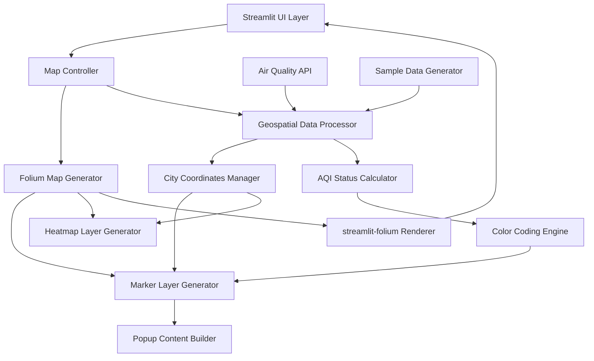
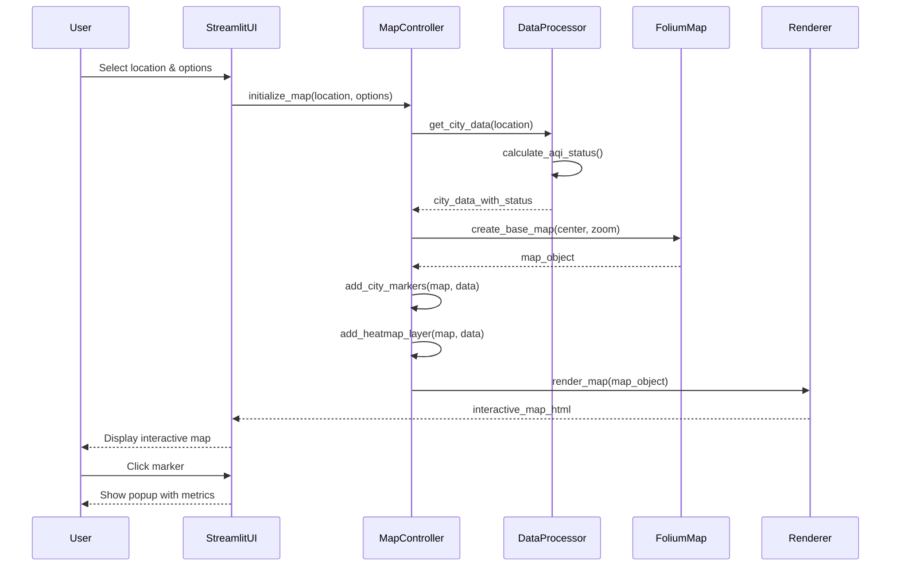

# Design Document: Interactive Geospatial Maps

## Overview

This feature adds interactive geospatial visualization capabilities to the TerraPulse AI environmental monitoring dashboard. The implementation integrates folium-based interactive maps into the existing Streamlit application, enabling users to visualize environmental data spatially across Indian cities (Ahmedabad, Surat, Mumbai). The maps will display location markers with color-coded AQI status indicators, interactive popups showing real-time environmental metrics, and optional heatmap layers for pollution visualization. This enhancement transforms the dashboard from a tabular/chart-based interface into a spatially-aware monitoring system, allowing users to understand environmental patterns geographically.

## Architecture

The geospatial feature integrates into the existing Streamlit application architecture as a new visualization layer. The system follows a modular design where map generation, data processing, and rendering are separated into distinct components.



## Main Workflow



## Components and Interfaces

### Component 1: MapController

**Purpose**: Orchestrates map creation, data integration, and layer management

**Interface**:
```python
class MapController:
    def create_environmental_map(
        self, 
        cities_data: List[CityEnvironmentalData],
        center_location: Tuple[float, float],
        zoom_level: int = 6,
        show_heatmap: bool = False
    ) -> folium.Map
    
    def add_city_markers(
        self,
        map_obj: folium.Map,
        cities_data: List[CityEnvironmentalData]
    ) -> None
    
    def add_heatmap_layer(
        self,
        map_obj: folium.Map,
        pollution_data: List[Tuple[float, float, float]]
    ) -> None
```

**Responsibilities**:
- Create and configure base folium map with appropriate center and zoom
- Add city markers with color-coded status indicators
- Generate and attach heatmap layers for pollution visualization
- Coordinate between data processing and map rendering components


### Component 2: GeospatialDataProcessor

**Purpose**: Process environmental data and prepare it for geospatial visualization

**Interface**:
```python
class GeospatialDataProcessor:
    def get_cities_environmental_data(
        self,
        cities: List[str],
        sample_data: pd.DataFrame,
        use_real_data: bool = False
    ) -> List[CityEnvironmentalData]
    
    def calculate_aqi_status(self, aqi_value: float) -> AQIStatus
    
    def prepare_heatmap_data(
        self,
        cities_data: List[CityEnvironmentalData]
    ) -> List[Tuple[float, float, float]]
    
    def get_city_coordinates(self, city_name: str) -> Tuple[float, float]
```

**Responsibilities**:
- Fetch and aggregate environmental data for specified cities
- Calculate AQI status categories and color codes
- Transform data into formats suitable for heatmap visualization
- Manage city coordinate lookups and validation


### Component 3: PopupContentBuilder

**Purpose**: Generate HTML content for interactive marker popups

**Interface**:
```python
class PopupContentBuilder:
    def build_city_popup(
        self,
        city_data: CityEnvironmentalData
    ) -> str
    
    def format_metric_row(
        self,
        label: str,
        value: float,
        unit: str,
        icon: str = ""
    ) -> str
    
    def get_aqi_status_html(
        self,
        aqi_value: float,
        status: AQIStatus
    ) -> str
```

**Responsibilities**:
- Generate formatted HTML for popup content with environmental metrics
- Create visually appealing metric displays with icons and colors
- Format AQI status indicators with appropriate styling
- Ensure popup content is responsive and readable


### Component 4: MarkerStyleManager

**Purpose**: Manage marker appearance based on environmental data

**Interface**:
```python
class MarkerStyleManager:
    def get_marker_color(self, aqi_status: AQIStatus) -> str
    
    def get_marker_icon(self, aqi_status: AQIStatus) -> folium.Icon
    
    def create_custom_marker(
        self,
        location: Tuple[float, float],
        popup_html: str,
        aqi_status: AQIStatus,
        city_name: str
    ) -> folium.Marker
```

**Responsibilities**:
- Map AQI status to appropriate marker colors (green, yellow, orange, red)
- Create folium marker objects with custom styling
- Manage icon selection and appearance
- Ensure visual consistency across all markers


## Data Models

### Model 1: CityEnvironmentalData

```python
class CityEnvironmentalData:
    city_name: str
    latitude: float
    longitude: float
    aqi: float
    co2: float
    temperature: float
    humidity: float
    wind_speed: float
    rainfall: float
    aqi_status: AQIStatus
    timestamp: datetime
```

**Validation Rules**:
- city_name must be non-empty string
- latitude must be between -90 and 90
- longitude must be between -180 and 180
- aqi must be non-negative (0-500 range typical)
- co2 must be positive (typical range 300-600 ppm)
- temperature must be within reasonable range (-50 to 60 Celsius)
- humidity must be between 0 and 100
- wind_speed must be non-negative
- rainfall must be non-negative


### Model 2: AQIStatus

```python
class AQIStatus:
    level: str  # "Good", "Moderate", "Unhealthy for Sensitive Groups", "Unhealthy", "Very Unhealthy", "Hazardous"
    color: str  # "green", "yellow", "orange", "red", "purple", "maroon"
    aqi_range: Tuple[float, float]
    description: str
    health_implications: str
```

**Validation Rules**:
- level must be one of the six standard AQI categories
- color must be valid CSS color name or hex code
- aqi_range must have min < max
- description must be non-empty
- health_implications must be non-empty

### Model 3: MapConfiguration

```python
class MapConfiguration:
    center_lat: float
    center_lon: float
    zoom_level: int
    show_heatmap: bool
    heatmap_radius: int
    heatmap_blur: int
    heatmap_max_zoom: int
    tile_layer: str  # "OpenStreetMap", "CartoDB positron", etc.
```

**Validation Rules**:
- center_lat must be between -90 and 90
- center_lon must be between -180 and 180
- zoom_level must be between 1 and 18
- heatmap_radius must be positive integer
- heatmap_blur must be positive integer
- tile_layer must be valid folium tile layer name


## Key Functions with Formal Specifications

### Function 1: create_environmental_map()

```python
def create_environmental_map(
    cities_data: List[CityEnvironmentalData],
    center_location: Tuple[float, float],
    zoom_level: int = 6,
    show_heatmap: bool = False
) -> folium.Map
```

**Preconditions:**
- cities_data is non-empty list of valid CityEnvironmentalData objects
- center_location is tuple of (latitude, longitude) with valid coordinates
- zoom_level is integer between 1 and 18
- All city coordinates in cities_data are valid (lat: -90 to 90, lon: -180 to 180)

**Postconditions:**
- Returns valid folium.Map object
- Map is centered at center_location with specified zoom_level
- All cities in cities_data have corresponding markers on the map
- If show_heatmap is True, heatmap layer is added to the map
- Map contains interactive elements (zoom, pan controls)
- No mutations to input cities_data

**Loop Invariants:** 
- For marker addition loop: All previously added markers remain valid and visible
- For heatmap data loop: All processed data points maintain coordinate validity


### Function 2: calculate_aqi_status()

```python
def calculate_aqi_status(aqi_value: float) -> AQIStatus
```

**Preconditions:**
- aqi_value is non-negative float
- aqi_value is within reasonable range (0-500)

**Postconditions:**
- Returns valid AQIStatus object
- Returned status.level matches EPA AQI category for given aqi_value
- Returned status.color corresponds to standard AQI color coding
- status.aqi_range contains the aqi_value
- No side effects

**Loop Invariants:** N/A (no loops in function)

### Function 3: build_city_popup()

```python
def build_city_popup(city_data: CityEnvironmentalData) -> str
```

**Preconditions:**
- city_data is valid CityEnvironmentalData object
- All numeric fields in city_data are valid numbers (not NaN or Infinity)
- city_data.city_name is non-empty string

**Postconditions:**
- Returns valid HTML string
- HTML contains all environmental metrics from city_data
- HTML is properly formatted and escaped
- HTML includes AQI status with appropriate color styling
- Returned string length is reasonable (< 10KB)
- No mutations to input city_data

**Loop Invariants:**
- For metric formatting loop: All previously formatted metrics maintain valid HTML structure


### Function 4: prepare_heatmap_data()

```python
def prepare_heatmap_data(
    cities_data: List[CityEnvironmentalData]
) -> List[Tuple[float, float, float]]
```

**Preconditions:**
- cities_data is non-empty list
- All city_data objects have valid coordinates
- All city_data objects have valid aqi values (non-negative)

**Postconditions:**
- Returns list of tuples (latitude, longitude, intensity)
- Length of returned list equals length of cities_data
- All latitude values are between -90 and 90
- All longitude values are between -180 and 180
- All intensity values are normalized between 0 and 1
- No mutations to input cities_data

**Loop Invariants:**
- All processed data points maintain coordinate validity
- Intensity normalization preserves relative ordering of AQI values


## Algorithmic Pseudocode

### Main Map Creation Algorithm

```pascal
ALGORITHM createEnvironmentalMap(citiesData, centerLocation, zoomLevel, showHeatmap)
INPUT: citiesData (list of CityEnvironmentalData), centerLocation (tuple), zoomLevel (int), showHeatmap (bool)
OUTPUT: mapObject (folium.Map)

BEGIN
  ASSERT citiesData is not empty
  ASSERT centerLocation has valid coordinates
  ASSERT zoomLevel is between 1 and 18
  
  // Step 1: Initialize base map
  mapObject ← createFoliumMap(
    location = centerLocation,
    zoom_start = zoomLevel,
    tiles = "OpenStreetMap"
  )
  
  // Step 2: Add city markers with loop invariant
  FOR each cityData IN citiesData DO
    ASSERT allPreviousMarkersValid(mapObject)
    
    aqiStatus ← calculateAQIStatus(cityData.aqi)
    popupHTML ← buildCityPopup(cityData)
    markerColor ← getMarkerColor(aqiStatus)
    
    marker ← createMarker(
      location = (cityData.latitude, cityData.longitude),
      popup = popupHTML,
      icon = createIcon(color = markerColor, icon = "info-sign"),
      tooltip = cityData.city_name
    )
    
    addMarkerToMap(mapObject, marker)
  END FOR
  
  // Step 3: Add heatmap layer if requested
  IF showHeatmap = true THEN
    heatmapData ← prepareHeatmapData(citiesData)
    heatmapLayer ← createHeatmapLayer(
      data = heatmapData,
      radius = 50,
      blur = 35,
      max_zoom = 13
    )
    addLayerToMap(mapObject, heatmapLayer)
  END IF
  
  ASSERT mapObject is valid and renderable
  ASSERT mapObject contains markers for all cities
  
  RETURN mapObject
END
```

**Preconditions:**
- citiesData is validated and non-empty
- centerLocation contains valid latitude and longitude
- zoomLevel is within valid range (1-18)

**Postconditions:**
- mapObject is complete and renderable
- All city markers are added to the map
- Heatmap layer is added if showHeatmap is true
- Map state is consistent and interactive

**Loop Invariants:**
- All previously added markers remain valid and attached to map
- Map object maintains valid state throughout iteration


### AQI Status Calculation Algorithm

```pascal
ALGORITHM calculateAQIStatus(aqiValue)
INPUT: aqiValue (float)
OUTPUT: aqiStatus (AQIStatus)

BEGIN
  ASSERT aqiValue >= 0
  
  // Define AQI breakpoints based on EPA standards
  IF aqiValue < 50 THEN
    level ← "Good"
    color ← "green"
    range ← (0, 50)
    description ← "Air quality is satisfactory"
    healthImplications ← "Air quality is considered satisfactory, and air pollution poses little or no risk"
  
  ELSE IF aqiValue < 100 THEN
    level ← "Moderate"
    color ← "yellow"
    range ← (51, 100)
    description ← "Air quality is acceptable"
    healthImplications ← "Air quality is acceptable for most people"
  
  ELSE IF aqiValue < 150 THEN
    level ← "Unhealthy for Sensitive Groups"
    color ← "orange"
    range ← (101, 150)
    description ← "Members of sensitive groups may experience health effects"
    healthImplications ← "Sensitive groups should reduce prolonged outdoor exertion"
  
  ELSE IF aqiValue < 200 THEN
    level ← "Unhealthy"
    color ← "red"
    range ← (151, 200)
    description ← "Everyone may begin to experience health effects"
    healthImplications ← "Everyone should reduce prolonged outdoor exertion"
  
  ELSE IF aqiValue < 300 THEN
    level ← "Very Unhealthy"
    color ← "purple"
    range ← (201, 300)
    description ← "Health alert: everyone may experience more serious health effects"
    healthImplications ← "Everyone should avoid all outdoor exertion"
  
  ELSE
    level ← "Hazardous"
    color ← "maroon"
    range ← (301, 500)
    description ← "Health warnings of emergency conditions"
    healthImplications ← "Everyone should remain indoors"
  END IF
  
  aqiStatus ← createAQIStatus(level, color, range, description, healthImplications)
  
  ASSERT aqiStatus is valid
  ASSERT aqiValue is within aqiStatus.range
  
  RETURN aqiStatus
END
```

**Preconditions:**
- aqiValue is non-negative number
- aqiValue is within reasonable range (0-500)

**Postconditions:**
- Returns valid AQIStatus object
- aqiStatus.level matches EPA standard for given aqiValue
- aqiStatus.color follows standard AQI color coding
- aqiValue falls within returned aqiStatus.range

**Loop Invariants:** N/A (no loops)


### Popup Content Generation Algorithm

```pascal
ALGORITHM buildCityPopup(cityData)
INPUT: cityData (CityEnvironmentalData)
OUTPUT: htmlString (string)

BEGIN
  ASSERT cityData is not null
  ASSERT cityData.city_name is non-empty
  
  // Step 1: Initialize HTML structure
  html ← "<div style='font-family: Arial; min-width: 250px;'>"
  
  // Step 2: Add city header
  html ← html + "<h3 style='margin: 0; color: #2c3e50;'>" + cityData.city_name + "</h3>"
  html ← html + "<hr style='margin: 10px 0;'>"
  
  // Step 3: Add AQI status with color coding
  aqiStatus ← calculateAQIStatus(cityData.aqi)
  html ← html + "<div style='background-color: " + aqiStatus.color + "; padding: 8px; border-radius: 4px; color: white; font-weight: bold; text-align: center;'>"
  html ← html + "AQI: " + formatNumber(cityData.aqi, 1) + " - " + aqiStatus.level
  html ← html + "</div>"
  
  // Step 4: Add environmental metrics with loop invariant
  metrics ← [
    ("Temperature", cityData.temperature, "°C", "🌡️"),
    ("Humidity", cityData.humidity, "%", "💧"),
    ("CO2", cityData.co2, "ppm", "🏭"),
    ("Wind Speed", cityData.wind_speed, "km/h", "🌬️"),
    ("Rainfall", cityData.rainfall, "mm", "🌧️")
  ]
  
  html ← html + "<div style='margin-top: 10px;'>"
  
  FOR each (label, value, unit, icon) IN metrics DO
    ASSERT html is valid HTML structure
    
    metricRow ← "<div style='margin: 5px 0;'>"
    metricRow ← metricRow + "<span style='font-weight: bold;'>" + icon + " " + label + ":</span> "
    metricRow ← metricRow + formatNumber(value, 1) + " " + unit
    metricRow ← metricRow + "</div>"
    
    html ← html + metricRow
  END FOR
  
  html ← html + "</div>"
  html ← html + "</div>"
  
  ASSERT html is valid HTML
  ASSERT html length is reasonable (< 10KB)
  
  RETURN html
END
```

**Preconditions:**
- cityData is valid CityEnvironmentalData object
- All numeric fields are valid numbers (not NaN or Infinity)
- city_name is non-empty string

**Postconditions:**
- Returns valid HTML string
- HTML contains all environmental metrics
- HTML is properly formatted and escaped
- HTML includes color-coded AQI status
- No mutations to cityData

**Loop Invariants:**
- HTML structure remains valid throughout metric addition
- All previously added metrics maintain proper formatting


### Heatmap Data Preparation Algorithm

```pascal
ALGORITHM prepareHeatmapData(citiesData)
INPUT: citiesData (list of CityEnvironmentalData)
OUTPUT: heatmapPoints (list of tuples)

BEGIN
  ASSERT citiesData is not empty
  
  // Step 1: Find max AQI for normalization
  maxAQI ← 0
  FOR each cityData IN citiesData DO
    IF cityData.aqi > maxAQI THEN
      maxAQI ← cityData.aqi
    END IF
  END FOR
  
  ASSERT maxAQI > 0
  
  // Step 2: Create heatmap points with normalized intensity
  heatmapPoints ← empty list
  
  FOR each cityData IN citiesData DO
    ASSERT allPreviousPointsValid(heatmapPoints)
    ASSERT cityData.latitude is between -90 and 90
    ASSERT cityData.longitude is between -180 and 180
    
    // Normalize AQI to 0-1 range for heatmap intensity
    normalizedIntensity ← cityData.aqi / maxAQI
    
    point ← (cityData.latitude, cityData.longitude, normalizedIntensity)
    
    heatmapPoints.append(point)
  END FOR
  
  ASSERT length(heatmapPoints) = length(citiesData)
  ASSERT all intensities are between 0 and 1
  
  RETURN heatmapPoints
END
```

**Preconditions:**
- citiesData is non-empty list
- All city_data objects have valid coordinates
- All city_data objects have valid aqi values (non-negative)

**Postconditions:**
- Returns list of tuples (lat, lon, intensity)
- Length of returned list equals length of citiesData
- All coordinates are valid
- All intensities are normalized between 0 and 1
- Relative ordering of AQI values is preserved
- No mutations to citiesData

**Loop Invariants:**
- All processed points maintain valid coordinates
- Intensity normalization preserves relative AQI ordering
- heatmapPoints list maintains consistent structure


## Example Usage

```python
# Example 1: Basic map creation with city markers
from map_controller import MapController
from data_processor import GeospatialDataProcessor

# Initialize components
data_processor = GeospatialDataProcessor()
map_controller = MapController()

# Get environmental data for cities
cities = ["Ahmedabad", "Surat", "Mumbai"]
cities_data = data_processor.get_cities_environmental_data(
    cities=cities,
    sample_data=sample_data,
    use_real_data=True
)

# Create map centered on India
center_location = (22.0, 73.0)  # Central India
env_map = map_controller.create_environmental_map(
    cities_data=cities_data,
    center_location=center_location,
    zoom_level=6,
    show_heatmap=False
)

# Render in Streamlit
import streamlit as st
from streamlit_folium import folium_static

folium_static(env_map, width=1200, height=600)
```

```python
# Example 2: Map with heatmap layer
env_map_with_heatmap = map_controller.create_environmental_map(
    cities_data=cities_data,
    center_location=(22.0, 73.0),
    zoom_level=6,
    show_heatmap=True
)

folium_static(env_map_with_heatmap, width=1200, height=600)
```

```python
# Example 3: Custom popup content
from popup_builder import PopupContentBuilder

popup_builder = PopupContentBuilder()

for city_data in cities_data:
    popup_html = popup_builder.build_city_popup(city_data)
    print(f"Popup for {city_data.city_name}:")
    print(popup_html)
```

```python
# Example 4: AQI status calculation
from data_processor import GeospatialDataProcessor

processor = GeospatialDataProcessor()

aqi_values = [45, 85, 125, 175, 225, 325]
for aqi in aqi_values:
    status = processor.calculate_aqi_status(aqi)
    print(f"AQI {aqi}: {status.level} ({status.color})")

# Output:
# AQI 45: Good (green)
# AQI 85: Moderate (yellow)
# AQI 125: Unhealthy for Sensitive Groups (orange)
# AQI 175: Unhealthy (red)
# AQI 225: Very Unhealthy (purple)
# AQI 325: Hazardous (maroon)
```

```python
# Example 5: Integration with existing Streamlit sidebar
import streamlit as st

# Sidebar controls (existing)
location = st.sidebar.selectbox("Select Location", ["Ahmedabad", "Surat", "Mumbai"])
show_heatmap = st.sidebar.checkbox("Show Pollution Heatmap", value=False)
map_style = st.sidebar.selectbox("Map Style", ["OpenStreetMap", "CartoDB positron", "CartoDB dark_matter"])

# Get data for selected location
selected_city_data = data_processor.get_cities_environmental_data(
    cities=[location],
    sample_data=sample_data,
    use_real_data=use_real_data
)

# Create and display map
city_coords = data_processor.get_city_coordinates(location)
env_map = map_controller.create_environmental_map(
    cities_data=selected_city_data,
    center_location=city_coords,
    zoom_level=10,
    show_heatmap=show_heatmap
)

st.subheader(f"Environmental Map - {location}")
folium_static(env_map, width=1200, height=600)
```


## Correctness Properties

*A property is a characteristic or behavior that should hold true across all valid executions of a system—essentially, a formal statement about what the system should do. Properties serve as the bridge between human-readable specifications and machine-verifiable correctness guarantees.*

### Property 1: Map Centering and Zoom Validity

*For any* location selection and zoom level, when a map is created, the map center should be set to the selected location coordinates and the zoom level should be clamped to the valid range of 1 to 18.

**Validates: Requirements 1.1, 1.2, 19.2, 19.3**

### Property 2: Marker Completeness

*For any* list of cities with valid data, when markers are added to the map, the number of markers on the map should equal the number of cities in the input list.

**Validates: Requirements 1.3, 16.1, 19.1**

### Property 3: AQI Status Classification

*For any* AQI value in the range [0, 500], when the status is calculated, the value should be classified into exactly one of the six EPA standard categories (Good, Moderate, Unhealthy for Sensitive Groups, Unhealthy, Very Unhealthy, Hazardous) based on the standard breakpoints.

**Validates: Requirements 3.1, 3.2, 3.3, 3.4, 3.5, 3.6**

### Property 4: Marker Color Consistency

*For any* city with an AQI status, when a marker is created, the marker color should match the EPA standard color coding: Good=green, Moderate=yellow, Unhealthy for Sensitive Groups=orange, Unhealthy=red, Very Unhealthy=purple, Hazardous=maroon.

**Validates: Requirements 2.1, 2.2, 2.3, 2.4, 2.5, 2.6, 2.7**

### Property 5: Coordinate Validity

*For any* processed city environmental data, the latitude should be between -90 and 90, and the longitude should be between -180 and 180.

**Validates: Requirements 6.1, 6.2, 6.4**

### Property 6: Marker Positioning

*For any* city with valid coordinates, when a marker is added to the map, the marker should be positioned at exactly the city's latitude and longitude coordinates.

**Validates: Requirements 2.8**

### Property 7: Popup Content Completeness

*For any* city environmental data, when popup content is generated, the HTML should contain the city name, AQI value with color-coded status, temperature, humidity, CO2, wind speed, and rainfall metrics.

**Validates: Requirements 4.2, 4.3, 4.4**

### Property 8: Popup HTML Validity

*For any* city environmental data, when popup content is generated, the output should be valid HTML and less than 10KB in size.

**Validates: Requirements 4.5, 4.6**

### Property 9: HTML Escaping for Security

*For any* city data containing special characters in the city name or metric values, when popup HTML is generated, all special characters should be properly escaped to prevent XSS attacks.

**Validates: Requirements 4.7, 15.2**

### Property 10: Heatmap Layer Presence

*For any* map configuration, when the heatmap option is enabled, the map should contain a heatmap layer; when disabled, the map should not contain a heatmap layer.

**Validates: Requirements 5.1, 5.2, 19.4**

### Property 11: Heatmap Intensity Normalization

*For any* list of cities with AQI values, when heatmap data is prepared, all intensity values should be normalized to the range [0, 1], with the maximum AQI value mapping to intensity 1.0.

**Validates: Requirements 5.3, 5.4, 18.4**

### Property 12: Heatmap Data Completeness

*For any* list of cities, when heatmap data is prepared, the number of heatmap data points should equal the number of cities, and each city should have exactly one corresponding data point.

**Validates: Requirements 18.1, 18.2**

### Property 13: Heatmap Intensity Ordering Preservation

*For any* two cities A and B, if city A has a higher AQI value than city B, then city A's heatmap intensity should be greater than or equal to city B's heatmap intensity after normalization.

**Validates: Requirements 18.3**

### Property 14: Invalid Coordinate Filtering

*For any* list of cities including some with invalid coordinates, when the data is processed, cities with coordinates outside the valid ranges should be filtered out and not appear in the final marker list.

**Validates: Requirements 6.3, 9.2**

### Property 15: Environmental Data Completeness

*For any* created city environmental data object, it should include all required fields: AQI, CO2, temperature, humidity, wind speed, and rainfall values.

**Validates: Requirements 7.3**

### Property 16: AQI Status Inclusion

*For any* city environmental data that is processed, the data should include a calculated AQI_Status with level, color, description, and health implications.

**Validates: Requirements 3.7, 7.4**

### Property 17: Data Immutability

*For any* processing function (create_environmental_map, calculate_aqi_status, build_city_popup, prepare_heatmap_data), when called with input data, the input data should remain unchanged after the function completes.

**Validates: Requirements 8.1, 8.2, 8.3, 8.4**

### Property 18: AQI Value Clamping

*For any* AQI value that is negative or greater than 1000, when processed, the value should be clamped to the valid range [0, 500], with negative values set to 0 and values over 1000 set to 500.

**Validates: Requirements 11.1, 11.2**

### Property 19: Adjusted Data Marking

*For any* AQI value that has been clamped or adjusted, when displayed in a popup, the data point should be marked as "estimated" or include a data quality indicator.

**Validates: Requirements 11.4**

### Property 20: Environmental Metric Validation

*For any* created city environmental data, all metrics should be within valid ranges: AQI ≥ 0, CO2 > 0, -50 ≤ temperature ≤ 60, 0 ≤ humidity ≤ 100, wind_speed ≥ 0, rainfall ≥ 0.

**Validates: Requirements 14.1, 14.2, 14.3, 14.4, 14.5**

### Property 21: City Whitelist Validation

*For any* city name received from user input, the system should only accept cities that are in the predefined whitelist of known cities.

**Validates: Requirements 15.1**

### Property 22: API Key Security

*For any* rendered map output or client-side code, API keys should not be present in the HTML, JavaScript, or any client-accessible content.

**Validates: Requirements 15.5**

### Property 23: Map Style Application

*For any* selected map style (tile layer), when a map is created, the map should use the corresponding tile provider for that style.

**Validates: Requirements 12.1**

### Property 24: Interactive Controls Presence

*For any* created map, the map should have interactive controls enabled for zoom and pan operations.

**Validates: Requirements 1.4, 12.4**

### Property 25: Multi-City Map Centering

*For any* set of multiple cities displayed on a map, the map center should be positioned such that all city markers are visible within the viewport at the selected zoom level.

**Validates: Requirements 16.2**

### Property 26: Marker Interactivity

*For any* marker added to the map, the marker should be clickable and display a popup when clicked.

**Validates: Requirements 4.1, 16.3**

### Property 27: Heatmap Coverage

*For any* map with heatmap enabled and multiple cities, the heatmap layer should include data points for all city locations.

**Validates: Requirements 16.4**

### Property 28: Known City Coordinate Validity

*For any* known city (Ahmedabad, Surat, Mumbai), when coordinates are requested, the returned coordinates should be valid (within proper latitude/longitude ranges).

**Validates: Requirements 17.2**


## Error Handling

### Error Scenario 1: Invalid City Coordinates

**Condition**: City name provided does not exist in coordinate database
**Response**: 
- Log warning message with city name
- Return None or raise CityNotFoundError
- Display user-friendly error message in Streamlit UI
**Recovery**: 
- Fall back to default coordinates (center of India)
- Skip the invalid city in marker generation
- Continue processing remaining valid cities

### Error Scenario 2: API Failure for Real-Time Data

**Condition**: Air quality API request fails (timeout, network error, invalid response)
**Response**:
- Catch exception and log error details
- Display warning message to user: "API unavailable. Using simulated data."
- Fall back to simulated data generation
**Recovery**:
- Use existing sample_data DataFrame
- Generate reasonable random values based on historical patterns
- Continue map rendering with simulated data

### Error Scenario 3: Invalid AQI Value

**Condition**: AQI value is negative, NaN, or unreasonably high (> 1000)
**Response**:
- Validate AQI value before processing
- Log warning with city name and invalid value
- Clamp value to valid range (0-500)
**Recovery**:
- Use clamped value for visualization
- Display data quality warning in popup
- Mark data point as "estimated" or "uncertain"

### Error Scenario 4: Folium Rendering Failure

**Condition**: Map object fails to render in Streamlit (library version mismatch, browser compatibility)
**Response**:
- Catch rendering exception
- Display error message with troubleshooting steps
- Log full stack trace for debugging
**Recovery**:
- Attempt to render with simplified map (no heatmap, basic markers)
- Provide fallback to tabular data view
- Suggest browser refresh or library update

### Error Scenario 5: Empty Cities Data

**Condition**: cities_data list is empty or all cities have invalid data
**Response**:
- Validate input before map creation
- Raise ValueError with descriptive message
- Display user-friendly message in Streamlit
**Recovery**:
- Show placeholder message: "No valid city data available"
- Provide option to use default cities (Ahmedabad, Surat, Mumbai)
- Display data table instead of map

### Error Scenario 6: Heatmap Layer Creation Failure

**Condition**: Insufficient data points for heatmap or folium.plugins.HeatMap fails
**Response**:
- Catch exception during heatmap layer creation
- Log warning message
- Continue map rendering without heatmap layer
**Recovery**:
- Display map with markers only
- Show informational message: "Heatmap unavailable (insufficient data)"
- Disable heatmap checkbox in UI


## Testing Strategy

### Unit Testing Approach

**Test Coverage Goals**: Minimum 85% code coverage for all geospatial components

**Key Test Cases**:

1. **MapController Tests**
   - Test map creation with valid inputs
   - Test map creation with empty cities list (should raise ValueError)
   - Test marker addition for single city
   - Test marker addition for multiple cities
   - Test heatmap layer addition
   - Test map without heatmap layer
   - Verify map center and zoom level are set correctly

2. **GeospatialDataProcessor Tests**
   - Test get_city_coordinates with valid city names
   - Test get_city_coordinates with invalid city name (should return None or raise error)
   - Test calculate_aqi_status for all AQI ranges (0-50, 51-100, 101-150, 151-200, 201-300, 301+)
   - Test calculate_aqi_status with edge values (0, 50, 100, 150, 200, 300, 500)
   - Test calculate_aqi_status with invalid values (negative, NaN)
   - Test prepare_heatmap_data with valid cities data
   - Test prepare_heatmap_data with empty list
   - Verify intensity normalization is correct

3. **PopupContentBuilder Tests**
   - Test build_city_popup with complete city data
   - Test build_city_popup with missing optional fields
   - Verify HTML output is valid and well-formed
   - Test HTML escaping for special characters in city names
   - Verify all metrics are included in output
   - Test popup size is within reasonable limits

4. **MarkerStyleManager Tests**
   - Test get_marker_color for each AQI status level
   - Verify color mapping is consistent with EPA standards
   - Test marker icon creation
   - Test custom marker creation with all parameters

**Testing Framework**: pytest with pytest-cov for coverage reporting

**Example Unit Test**:
```python
def test_calculate_aqi_status_good():
    processor = GeospatialDataProcessor()
    status = processor.calculate_aqi_status(45)
    assert status.level == "Good"
    assert status.color == "green"
    assert 0 <= 45 <= 50

def test_calculate_aqi_status_hazardous():
    processor = GeospatialDataProcessor()
    status = processor.calculate_aqi_status(350)
    assert status.level == "Hazardous"
    assert status.color == "maroon"
    assert status.aqi_range[0] <= 350
```


### Property-Based Testing Approach

**Property Test Library**: Hypothesis (Python)

**Key Properties to Test**:

1. **Coordinate Validity Property**
   - Generate random city data with arbitrary coordinates
   - Verify all coordinates remain within valid ranges after processing
   - Property: ∀ city_data, -90 ≤ latitude ≤ 90 ∧ -180 ≤ longitude ≤ 180

2. **AQI Status Consistency Property**
   - Generate random AQI values in range [0, 500]
   - Verify status calculation is deterministic and consistent
   - Property: ∀ aqi_value, calculate_aqi_status(aqi_value) always returns same status for same input

3. **Heatmap Normalization Property**
   - Generate random lists of city data with varying AQI values
   - Verify all intensities are normalized to [0, 1]
   - Property: ∀ cities_data, all intensities in prepare_heatmap_data(cities_data) are in [0, 1]

4. **Data Immutability Property**
   - Generate random city data
   - Call all processing functions
   - Verify input data is never mutated
   - Property: ∀ function f, ∀ input, f(input) does not modify input

5. **Popup HTML Validity Property**
   - Generate random city data with various field values
   - Verify generated HTML is always valid and parseable
   - Property: ∀ city_data, is_valid_html(build_city_popup(city_data)) = true

**Example Property Test**:
```python
from hypothesis import given, strategies as st

@given(st.floats(min_value=0, max_value=500))
def test_aqi_status_always_returns_valid_status(aqi_value):
    processor = GeospatialDataProcessor()
    status = processor.calculate_aqi_status(aqi_value)
    
    # Property: status is always valid
    assert status.level in ["Good", "Moderate", "Unhealthy for Sensitive Groups", 
                            "Unhealthy", "Very Unhealthy", "Hazardous"]
    assert status.color in ["green", "yellow", "orange", "red", "purple", "maroon"]
    assert status.aqi_range[0] <= aqi_value <= status.aqi_range[1] or aqi_value >= status.aqi_range[0]

@given(st.lists(st.floats(min_value=0, max_value=500), min_size=1, max_size=10))
def test_heatmap_intensities_always_normalized(aqi_values):
    # Create mock city data
    cities_data = [
        CityEnvironmentalData(
            city_name=f"City{i}",
            latitude=20.0 + i,
            longitude=70.0 + i,
            aqi=aqi,
            co2=400, temperature=25, humidity=60, wind_speed=10, rainfall=0
        )
        for i, aqi in enumerate(aqi_values)
    ]
    
    processor = GeospatialDataProcessor()
    heatmap_data = processor.prepare_heatmap_data(cities_data)
    
    # Property: all intensities are in [0, 1]
    for lat, lon, intensity in heatmap_data:
        assert 0 <= intensity <= 1
```

### Integration Testing Approach

**Integration Test Scenarios**:

1. **End-to-End Map Rendering**
   - Test complete workflow from data fetch to map display
   - Verify map renders correctly in Streamlit environment
   - Test with real API data (if available)
   - Test with simulated data fallback

2. **Sidebar Integration**
   - Test location selector updates map correctly
   - Test heatmap toggle functionality
   - Test map style selector changes tile layer
   - Verify all controls work together seamlessly

3. **Multi-City Visualization**
   - Test map with all three cities (Ahmedabad, Surat, Mumbai)
   - Verify all markers are visible and clickable
   - Test popup interactions for each city
   - Verify heatmap covers all city locations

4. **API Integration**
   - Test with OpenWeatherMap API
   - Test with AQICN API fallback
   - Test error handling when both APIs fail
   - Verify data transformation from API response to CityEnvironmentalData

5. **Performance Testing**
   - Test map rendering time with varying number of cities
   - Test heatmap performance with large datasets
   - Verify memory usage is reasonable
   - Test responsiveness of interactive elements

**Integration Test Framework**: pytest with Streamlit testing utilities

**Example Integration Test**:
```python
def test_complete_map_workflow():
    # Setup
    cities = ["Ahmedabad", "Surat", "Mumbai"]
    sample_data = generate_sample_data(days=7)
    
    # Execute
    data_processor = GeospatialDataProcessor()
    map_controller = MapController()
    
    cities_data = data_processor.get_cities_environmental_data(
        cities=cities,
        sample_data=sample_data,
        use_real_data=False
    )
    
    env_map = map_controller.create_environmental_map(
        cities_data=cities_data,
        center_location=(22.0, 73.0),
        zoom_level=6,
        show_heatmap=True
    )
    
    # Verify
    assert env_map is not None
    assert len(env_map._children) > 0  # Has markers
    assert any('HeatMap' in str(type(child)) for child in env_map._children.values())  # Has heatmap
```


## Performance Considerations

### Map Rendering Performance

**Challenge**: Large maps with many markers can slow down browser rendering

**Optimization Strategies**:
- Limit number of visible markers based on zoom level
- Use marker clustering for dense areas (folium.plugins.MarkerCluster)
- Lazy load heatmap layer only when requested
- Cache map objects when location/settings haven't changed
- Use lightweight tile layers (CartoDB positron) for faster loading

**Performance Targets**:
- Initial map load: < 2 seconds
- Marker interaction (click/hover): < 100ms response time
- Heatmap toggle: < 500ms to add/remove layer
- Map pan/zoom: Smooth 60fps interaction

### Data Processing Performance

**Challenge**: Processing environmental data for multiple cities with API calls

**Optimization Strategies**:
- Use Streamlit's @st.cache_data decorator for API responses
- Batch API requests when possible
- Implement request timeout (10 seconds max)
- Pre-compute AQI status during data fetch, not during rendering
- Use pandas vectorized operations for data transformations

**Performance Targets**:
- Data fetch for 3 cities: < 3 seconds
- AQI status calculation: < 1ms per city
- Heatmap data preparation: < 10ms for 10 cities

### Memory Usage

**Challenge**: Storing map objects and environmental data in Streamlit session

**Optimization Strategies**:
- Clear old map objects when creating new ones
- Limit historical data retention (max 30 days)
- Use efficient data structures (numpy arrays instead of lists where possible)
- Avoid storing large HTML strings in session state

**Memory Targets**:
- Map object: < 5MB per instance
- City data: < 1KB per city
- Total session state: < 50MB

### Browser Compatibility

**Considerations**:
- Test on Chrome, Firefox, Safari, Edge
- Ensure folium-generated JavaScript is compatible
- Provide fallback for browsers with JavaScript disabled
- Optimize for mobile browsers (responsive design)


## Security Considerations

### API Key Management

**Risk**: Exposure of API keys in source code or client-side JavaScript

**Mitigation**:
- Store API keys in environment variables (not in code)
- Use Streamlit secrets management for production deployment
- Implement rate limiting to prevent API quota exhaustion
- Use read-only API keys with minimal permissions
- Rotate API keys periodically

**Implementation**:
```python
import os
import streamlit as st

# Development: use environment variable
API_KEY = os.getenv('OPENWEATHER_API_KEY')

# Production: use Streamlit secrets
if not API_KEY and hasattr(st, 'secrets'):
    API_KEY = st.secrets.get('OPENWEATHER_API_KEY')
```

### Input Validation

**Risk**: Malicious input in city names or coordinates could cause injection attacks

**Mitigation**:
- Validate all user inputs against whitelist of known cities
- Sanitize city names before using in API requests
- Validate coordinate ranges (-90 to 90 for lat, -180 to 180 for lon)
- Escape HTML content in popup generation to prevent XSS
- Use parameterized queries if database integration is added

**Implementation**:
```python
def validate_city_name(city_name: str) -> bool:
    ALLOWED_CITIES = ["Ahmedabad", "Surat", "Mumbai"]
    return city_name in ALLOWED_CITIES

def sanitize_html(text: str) -> str:
    import html
    return html.escape(text)
```

### Data Privacy

**Risk**: Environmental data might contain sensitive location information

**Mitigation**:
- Only display aggregated city-level data (not individual addresses)
- Avoid storing user location preferences without consent
- Implement data retention policies (auto-delete old data)
- Comply with data protection regulations (GDPR, etc.)
- Provide clear privacy policy for data collection

### Third-Party Dependencies

**Risk**: Vulnerabilities in folium, streamlit-folium, or other libraries

**Mitigation**:
- Keep all dependencies updated to latest stable versions
- Monitor security advisories for used libraries
- Use dependency scanning tools (pip-audit, safety)
- Pin dependency versions in requirements.txt
- Regular security audits of dependency tree

### API Request Security

**Risk**: Man-in-the-middle attacks on API requests

**Mitigation**:
- Use HTTPS for all API requests (not HTTP)
- Verify SSL certificates
- Implement request timeout to prevent hanging connections
- Use secure random number generation for simulated data
- Log failed API requests for security monitoring


## Dependencies

### Required Python Libraries

**Core Dependencies**:
- `folium>=0.15.0` - Interactive map generation library
- `streamlit-folium>=0.15.0` - Streamlit integration for folium maps
- `streamlit>=1.28.0` - Web application framework (already installed)
- `pandas>=2.0.0` - Data manipulation (already installed)
- `numpy>=1.24.0` - Numerical operations (already installed)
- `requests>=2.31.0` - HTTP requests for API calls (already installed)

**Optional Dependencies**:
- `branca>=0.6.0` - HTML/JS generation for folium (installed with folium)
- `jinja2>=3.1.0` - Template engine for HTML generation (installed with folium)

### API Dependencies

**Air Quality Data APIs**:
- OpenWeatherMap Air Pollution API (free tier, no key required for basic access)
- AQICN API (fallback, uses demo token for testing)

**Map Tile Providers**:
- OpenStreetMap (default, free, no API key required)
- CartoDB (optional, free, no API key required)
- Stamen Terrain (optional, free, no API key required)

### System Requirements

**Python Version**: Python 3.8 or higher

**Browser Requirements**:
- Modern browser with JavaScript enabled
- Chrome 90+, Firefox 88+, Safari 14+, Edge 90+
- Mobile browsers supported (iOS Safari, Chrome Mobile)

**Network Requirements**:
- Internet connection for map tiles and API requests
- Outbound HTTPS access to tile servers and API endpoints

### Installation Instructions

**Update requirements.txt**:
```
torch
pandas
numpy
streamlit
plotly
opencv-python
scikit-learn
requests
folium>=0.15.0
streamlit-folium>=0.15.0
```

**Install dependencies**:
```bash
pip install -r requirements.txt
```

**Verify installation**:
```python
import folium
import streamlit_folium
print(f"folium version: {folium.__version__}")
print(f"streamlit-folium version: {streamlit_folium.__version__}")
```

### External Services

**OpenWeatherMap API**:
- Endpoint: `http://api.openweathermap.org/data/2.5/air_pollution`
- Rate Limit: 60 calls/minute (free tier)
- Documentation: https://openweathermap.org/api/air-pollution

**AQICN API** (Fallback):
- Endpoint: `https://api.waqi.info/feed/{city}/?token=demo`
- Rate Limit: Limited with demo token
- Documentation: https://aqicn.org/api/

**Map Tile Servers**:
- OpenStreetMap: https://tile.openstreetmap.org
- CartoDB: https://cartodb-basemaps-{s}.global.ssl.fastly.net
- No authentication required for basic usage
